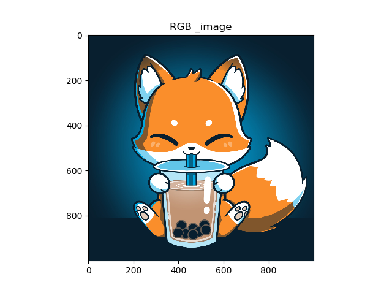
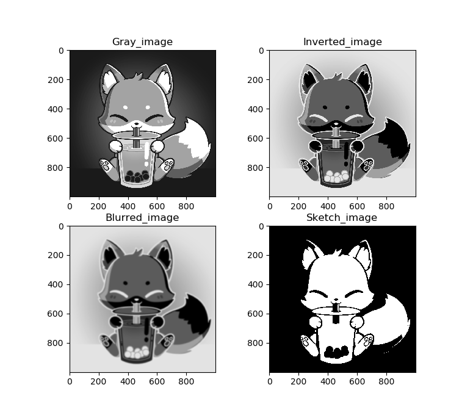
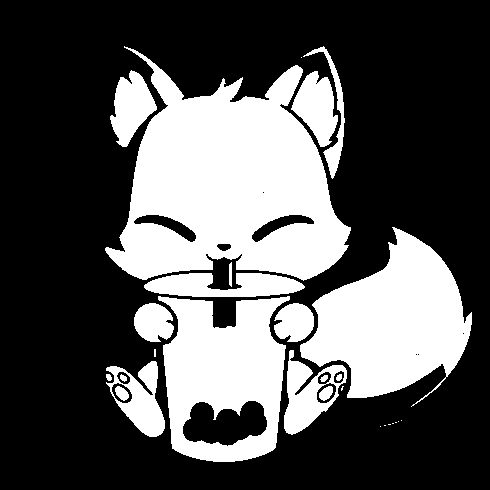

# Imagesketch 
## Summary
This is a sample project to convert an RGB image into sketch using basic computervision techniques

Intial RGB image is uploaded.

The RGB image is inverted and blurred. Thepixel values are readjusted in such a way that that final output is in the form of a sketch as shown below.

A sample google image is used in this project
## Final image

